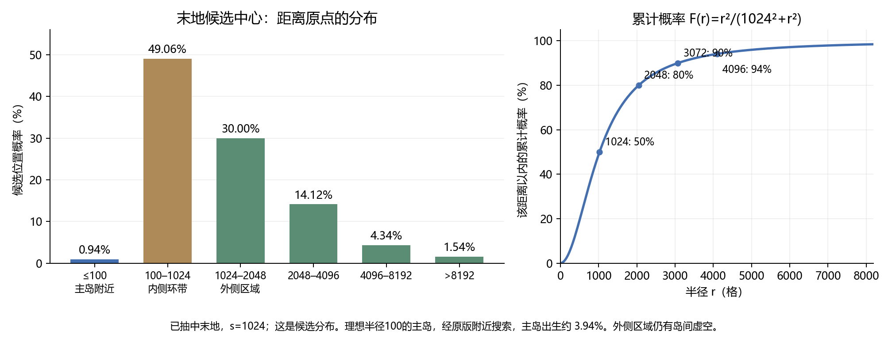

# RandomDimensionOpening

**A different dimension. The same vanilla survival rules.**

RandomDimensionOpening gives each world one shared starting dimension. Minecraft's
Overworld, Nether and End, plus every dimension actually loaded by your mods or
datapacks, enter the same equal-chance draw. The result is saved for that world.

## How a new world starts

- Every loaded dimension ID has the same chance. Empty and dangerous dimensions
  participate too; the mod does not reroll until it finds an easy start.
- A horizontal candidate position is drawn with an origin-favoured radial weight:
  `P(x,z) ∝ (scale² + x² + z²)⁻²`, with `scale = 1024` blocks by default.
  Nearby candidates are more common, while distant candidates remain possible.
- Minecraft's own spawn-search procedure chooses the actual ground and height
  near that candidate. Native spawn spread, collision handling and the optional
  bonus chest remain vanilla.
- The mod builds no platforms, clears no space, and adds no safety effect.
  A void dimension or an empty patch of the End can therefore be a dangerous start.

## One world, one shared spawn

New players first enter the selected dimension. When a player has no valid
personal respawn point, Minecraft's normal respawn fallback uses that shared
world spawn. Valid beds, respawn anchors and forced `/spawnpoint` locations keep
their normal priority. Returning players log back in at their saved location.

Adding a dimension later or reopening the world does not reroll the start.
End-return respawns keep vanilla inventory and anchor-charge rules. Worlds with
an existing 1.0.0 choice retain that choice when upgraded.

## Installation and compatibility

- **Minecraft 1.20.1, Forge 47.4.23 or a compatible later 47.x build, Java 17.**
- Singleplayer: put the JAR in your Forge instance's `mods` folder.
- Multiplayer: install **2.0.0 on the server**. Clients do not need this mod.
  Dimension mods may still require their own client-side installation.
- Replace the old `randimopen` JAR rather than loading both versions together.
- `config/randimopen-common.toml` contains `coordinate_scale`; it only affects
  worlds that have not yet selected their start.

The ordinary compass, portals, coordinate conversion, bed explosions and survival
progression keep their vanilla rules. The mod adds no blocks, items or dimensions.

## Where might an End start land?

After the End is selected, the default candidate distribution puts about 0.94%
of centres within 100 blocks, 49.06% in the 100–1024-block inner ring, and 50%
beyond 1024 blocks. Assuming a roughly circular main island of radius 100 blocks,
Minecraft's nearby search raises the estimated main-island start chance to about
**4%**. This is a simple geometric estimate, not a terrain survey across seeds.
Outer-island territory still contains void between islands; 50% is not a promise
of landing on solid ground. The Nether's normal collision adjustment can also
raise a spawn to the bedrock roof.

## License and older version

The original **2.0.0 code and new logo are CC0-1.0**: reuse, modify and redistribute
them freely. Third-party components retain their own licenses.

**1.0.0** remains available as its unchanged original MIT-licensed JAR. It chooses
between the three vanilla dimensions, uses its older fixed starting positions and
platforms, and requires the JAR on **both the client and server** for multiplayer.
Its behaviour and license are separate from 2.0.0.

---

## 中文：随机维度开局

每个存档从世界实际加载的全部维度中**等概率选一个共同开局维度**，包括原版、模组和
数据包维度。选择会保存，多人共用；重开世界或后来增加维度不重新抽签。

水平候选位置偏向原点，默认权重为 `(1024²+x²+z²)⁻²`。近处更常见，远处仍可能；
实际出生位置由原版在候选附近搜索天然地形并选择高度。原版出生散布、碰撞处理、床、
重生锚、强制出生点及末地返回规则继续生效。本模组不铺平台、不清空方块、不额外保命，
因此也可能在危险地形或虚空中开局。

新玩家首次出生、没有有效个人重生点时使用共同世界出生点；已有玩家登录保留退出时的位置。
原版指南针、传送门、坐标换算、床爆炸及生存进程不变。

上图以已抽中末地、默认尺度 1024 为条件。候选中心约 0.94% 在 100 格内、49.06% 在
100–1024 格内、50% 在 1024 格外。按半径约 100 格的主岛粗估，原版附近搜索能把主岛出生概率
提高到约 4%；实际随种子和岛形变化。外岛范围里也有岛间虚空，不能把 50% 理解为岛上落地率。
下界的原版碰撞上抬也可能把玩家带到基岩顶。

**2.0.0** 面向 Minecraft 1.20.1 / Forge 47.4.23 或兼容的后续 47.x / Java 17。
单机放入实例 `mods`；联机服务器安装，客户端无需本模组，但维度模组自身的客户端依赖仍需配齐。
新版代码和原创 Logo 使用 **CC0-1.0**。

**1.0.0** 原文件保持不变，沿用 MIT：仅在原版三维度中随机选择，带旧版固定起点和落脚平台；
联机需要客户端与服务器同时安装。升级已有旧版世界会保留原有开局选择。

## Build from source

Install a Java 17 JDK, then run `./gradlew build` (Windows: `gradlew.bat build`).
The pinned Forge baseline is 1.20.1-47.4.23; the output is `build/libs/randimopen-2.0.0-forge-1.20.1.jar`.

Official Forge setup: https://docs.minecraftforge.net/en/1.20.x/gettingstarted/
